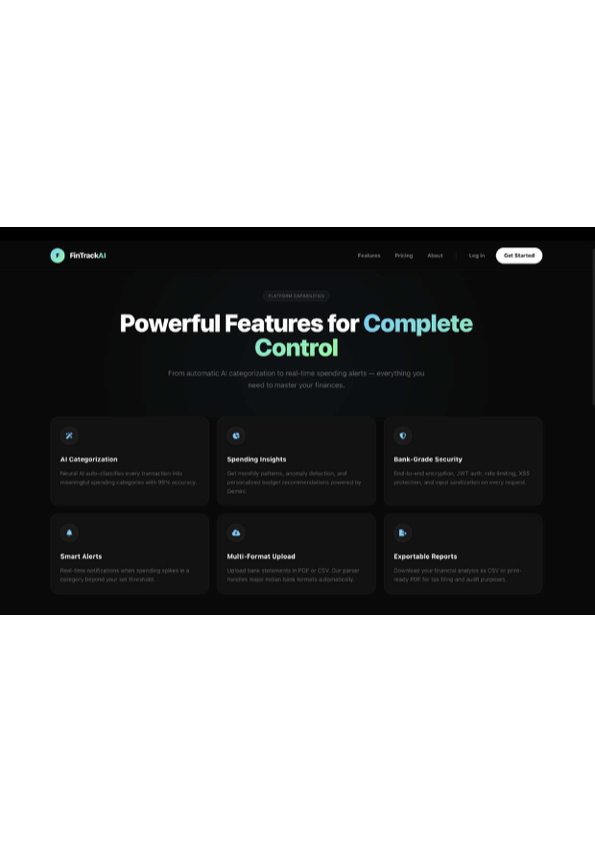

# FinTrackAI: AI-Powered Financial Intelligence

FinTrackAI is a comprehensive financial technology platform designed to provide automated expense tracking and actionable financial insights using the Google Gemini AI engine. The platform is built on the MERN stack (MongoDB, Express, React, Node.js) with a high-performance Vite frontend and secure JWT-based authentication

## Live Application
The production environment is accessible at the following URL:
[https://fin-track-ai-secure.vercel.app](https://fin-track-ai-secure.vercel.app)

## Preview

### Landing Page


### Features Section



## Core Capabilities

### AI-Driven Analytics
The platform integrates with the Google Gemini Pro API to perform deep analysis of financial data. It identifies spending patterns, detects redundant subscriptions, and suggests optimization strategies with high precision and anti-hallucination guardrails.

### Account Management
Secure user onboarding is handled via traditional email/password registration or Google OAuth 2.0. The authentication layer uses signed JWTs and bcrypt password hashing to ensure data privacy and integrity.

### Secure Data Processing
The backend is engineered for high-volume data handling, including CSV and PDF bank statement extraction. It utilizes a robust serverless architecture with managed MongoDB Atlas for persistent storage and dynamic connection pooling.

### Validated Ingestion and Categorization
The upgraded platform now supports additive CSV/PDF ingestion jobs with validation summaries, preview rows, structured MongoDB storage metadata, and lightweight expense categorization using rule-based matching plus TF-IDF-style scoring.

### Visualized Insights
A premium dashcard-driven interface provides real-time visualizations of weekly spending, savings growth, and categorical expenditure breakdowns using modern CSS-in-JS and optimized React components.

---

## Technical Architecture

### Directory Structure

```text
FinTrackAI_Secure/
├── backend/                # Node.js + Express API
│   ├── authentication/     # Core logic for Login, Signup, and OAuth
│   ├── models/             # Mongoose schemas for data persistence
│   ├── utils/              # Cryptographic helpers and secret management
│   └── server.js           # Service entry point and middleware configuration
│
└── frontendpart/           # React + Vite Client
    ├── src/
    │   ├── Authentication/ # User identity flows
    │   ├── Dashboard/      # Main application state and analytics
    │   ├── api/            # Centralized Axios abstraction layer
    │   └── App.jsx         # Router and Suspense boundaries
```

---

## Local Development Setup

### 1. Backend Service
1. Navigate to the backend directory and install dependencies:
   ```bash
   cd backend
   npm install
   ```
2. Configure the `.env` file with the following environment variables:
   - `MONGODB_URI`: Connection string for your MongoDB instance.
   - `JWT_SECRET`: Secure string for token signing.
   - `FRONTEND_URL`: Frontend origin used for redirects.
   - `BACKEND_URL`: Public backend base URL for OAuth callback generation.
   - `GEMINI_API_KEY`: API key for Google Gemini model access.
   - `GOOGLE_CLIENT_ID`: OAuth 2.0 client ID for Google Sign-In.
   - `GOOGLE_CLIENT_SECRET`: OAuth 2.0 client secret.
3. Start the service:
   ```bash
   npm run dev
   ```

### 2. Frontend Application
1. Navigate to the frontend directory and install dependencies:
   ```bash
   cd frontendpart
   npm install
   ```
2. Configure the `.env` file in the `frontendpart` directory:
   - `VITE_API_URL`: Path to the backend service (e.g., `http://localhost:8000/api`)
3. Launch the development server:
   ```bash
   npm run dev
   ```

---

## Additive Upgrade Modules

The current codebase includes the following additive modules without replacing the original stable flows:

- **Google OAuth metadata routing** for safer frontend login/signup startup
- **Validated ingestion service** for CSV/PDF uploads with preview and warning summaries
- **Categorization service** with lightweight ML-style scoring and rule fallback
- **Insights analytics engine** for savings, category, and dashboard summaries
- **Enhanced dashboard widgets** for spending, savings, and category intelligence

Legacy auth, upload, report, and transaction endpoints remain available for backward compatibility.

## New API Endpoints

### Auth
- `GET /api/auth/google/url`

### Ingestion
- `POST /api/ingestion/upload`
- `GET /api/ingestion/:id`

### Categorization
- `POST /api/categorization/preview`
- `POST /api/categorization/run`

### Analytics
- `GET /api/insights/summary`
- `GET /api/insights/categories`
- `GET /api/insights/savings`
- `GET /api/insights/dashboard`

## Verification Commands

### Backend smoke tests
```bash
cd backend
npm test
```

### Frontend production build
```bash
cd frontendpart
npm run build
```

---

## Security and Compliance

The platform implements several layers of security to protect sensitive financial information:
- **XSS Protection:** Enforced through Helmet security headers and React's automatic sanitization
- **Rate Limiting:** Protects authentication endpoints from automated brute-force attempts
- **Sanitization:** All inputs are passed through specialized middleware to prevent NoSQL injection
- **Encryption:** All persistent user passwords are encrypted using intensive salts and hash rotations
- **OAuth Safety:** Integrated guardrails prevent invalid authentication redirects if configurations are missing
